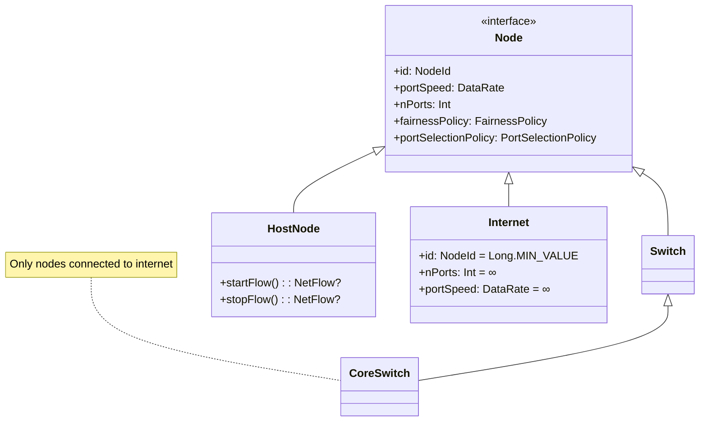
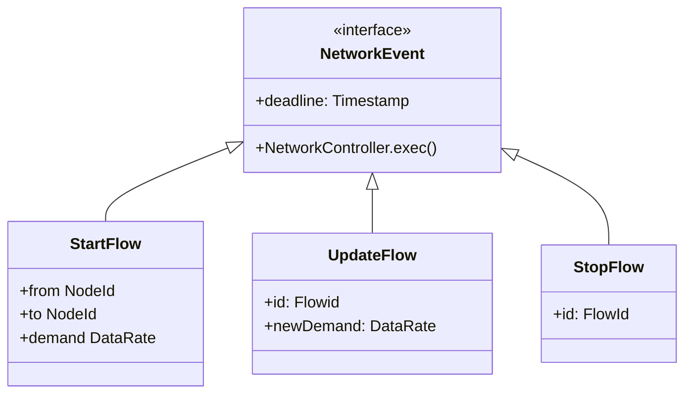

# Network Module Documentation
This documentation provides a high-level overview of the network simulator module, covering its implementation, output metrics, strengths, and weaknesses. Additionally, it includes instructions on how to run a network experiment and how to execute a combined compute-network experiment.

&nbsp;
> **NOTE**
> 
> Many of the `inline codes` are links to files, even if they are not highlighted as such.

> **NOTE**
>
> Documentation is very telegraphic, and it lacks of details. It will be updated.

## Design

### Nodes
The network is built of [`Nodes`](../../kotlin/org/opendc/simulator/network/components/Node.kt), such as [`HostNode`](../../kotlin/org/opendc/simulator/network/components/HostNode.kt), [`CoreSwitch`](../../kotlin/org/opendc/simulator/network/components/CoreSwitch.kt), [`Switch`](../../kotlin/org/opendc/simulator/network/components/Switch.kt) and an "abstract" node that represents the [`Internet`](../../kotlin/org/opendc/simulator/network/components/Internet.kt), with infinite "ports" and infinite bandwidth.

### Flows
Data transmission in the network is modeled as network flows [`NetFlows`](../../kotlin/org/opendc/simulator/network/api/NetFlow.kt). Each flow has a specified *demand*, a resulting *throughput* after routing through the network, and a total amount of *data transmitted* as the simulation progresses in virtual time. [`NetFlows`](../../kotlin/org/opendc/simulator/network/api/NetFlow.kt) are part of the module's [Api](#api) (check section for details).

### Network Events
Network workloads are represented as [`NetworkEvents`](../../kotlin/org/opendc/simulator/network/api/workload/NetworkEvent.kt), which can initiate, update the demand, or stop a network flow. Traces in the supported format (see [Trace Format](#trace-format)) are converted into a list of network events. Events with the same deadline are executed concurrently. Between different deadlines, the simulation pauses to ensure the network is stable (i.e., no updates need to be processed at any node), then advances virtual time and updates the tracked metrics.

### Port Selection Policy
Current [`PortSelectionPolicies`](../../kotlin/org/opendc/simulator/network/policies/forwarding/PortSelectionPolicy.kt) available:

| Policy                            | Performance Impact | Description                                                                             |
|-----------------------------------|:------------------:|:----------------------------------------------------------------------------------------|
| *Equal Cost Multi Path* (ECMP)    |      Moderate      | Distributes traffic across multiple equal-cost paths for load balancing and redundancy. |
| *Open Shortest Path First* (OSPF) |        Low         | Directs all traffic towards the shortest path (if multiple, random is chosen)           |

### Fairness Policy
Current [`FairnessPolicies`](../../kotlin/org/opendc/simulator/network/policies/fairness/FairnessPolicy.kt) available:

| Policy                    | Performance Impact | Description                                                                                            |
|---------------------------|:------------------:|:-------------------------------------------------------------------------------------------------------|
| *Max-Min*                 |      Moderate      | No flow has more bandwidth than another if the other has a higher demand. This is applied on each port |
| *First Come First Served* |        Low         | Available bandwidth is given to the first flow that is processed and needs it                          |

### Network Topology
The simulator is able to simulate any topology, both switch centric and server centric. The user can specify a custom topology, however, there are some predefined topologies that can be built with a few parameters that the simulator supports (details on how to specify them in JSON in section [Components Deserialization](#components-deserialization)):

| Name                                                         |           Parameters            |    Nodes    |  Links   |  Hosts   | Description                                                                       |
|--------------------------------------------------------------|:-------------------------------:|:-----------:|:--------:|:--------:|:----------------------------------------------------------------------------------|
| *3 Layer [Fat-Tree](https://en.wikipedia.org/wiki/Fat_tree)* |       n(ports-per-switch)       | $5n^3/(4n)$ | $3n^3/4$ | $n^3/4$  | Provides high bandwidth and redundancy by ensuring multiple paths between devices |
| *3 Layer Tree*                                               | n(children-per-node), k(layers) |             |          |          |                                                                                   |
| *Custom*                                                     |                -                |      -      |    -     |    -     | Defined by the user                                                               |

> **Add images**

## Implementation
> **Note**
> 
> This section will be much larger, only main concepts included now.

The network module uses kotlin [coroutines](https://kotlinlang.org/docs/coroutines-overview.html) extensively. Each [`Node`](../../kotlin/org/opendc/simulator/network/components/Node.kt) is run by a different coroutine, so that updates can propagate concurrently in the network.

The [`NetworkStabilityBarrier`](../../kotlin/org/opendc/simulator/network/components/stability/NetworkStabilityBarrier.kt) provides method `awaitStability` which allows to suspend until the network is stable (e.g., no updates are currently being processed). Nodes invalidate the barrier whenver they are processing an update and validate it again only after they sent successfully updates to adjacent nodes. At any point, any class can assert that it is performing a block of code while the network is stable by using the [NetworkStabilityChecker](../../kotlin/org/opendc/simulator/network/components/stability/NetworkStabilityChecker.kt) provided by the `CoroutineContext` the network runs in.

Observers handlers can be set on [`NetFlows`](../../kotlin/org/opendc/simulator/network/api/NetFlow.kt) and [`NetFlowBarriers`](../../kotlin/org/opendc/simulator/network/api/NetFlowBarrier.kt), which is a barrier that allows to track and set handlers on events that pertain multiple flows. In particular:

For [`NetFlows`](../../kotlin/org/opendc/simulator/network/api/NetFlow.kt):
- Throughput changes
- Demand changes
- Flow completes fragment (you can set a target data size to be transmitted starting at a certain point)
- Expected time to complete fragment increased
- Expected time to complete fragment decreased

Fir [`NetFlowBarriers`](../../kotlin/org/opendc/simulator/network/api/NetFlowBarrier.kt):
- All flows completed fragment
- One flow completed fragment
- Expected time for all flows to complete fragment increased
- Expected time for all flows to complete fragment decreased

### Trace Format

### Components Deserialization

## REPL

## Running a Network Experiment

## Api & Integration

## Running a Compute-Network Experiment
