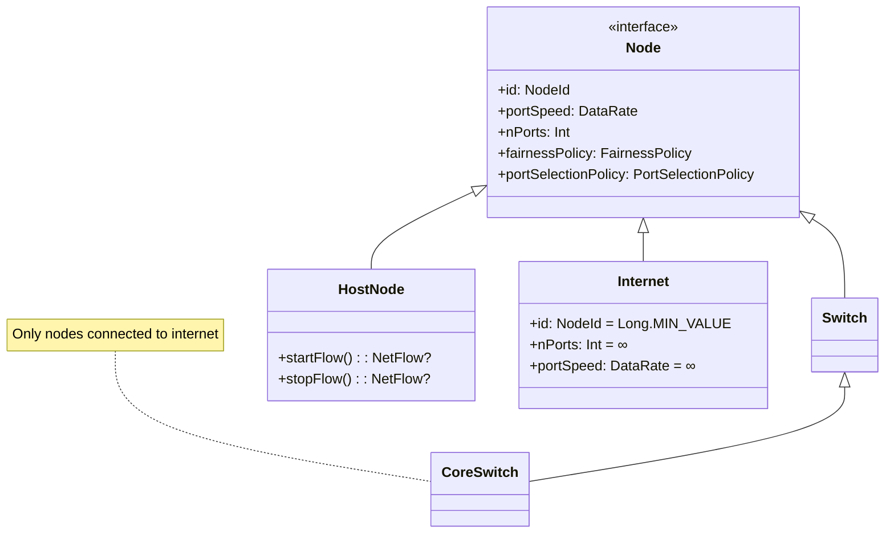
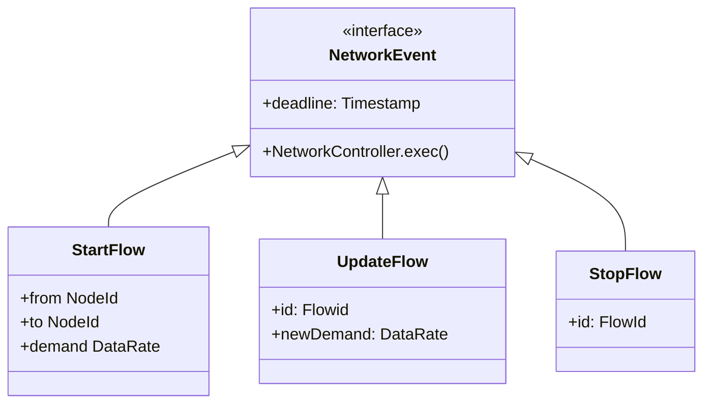

# Network Module Documentation
This documentation provides a high-level overview of the network simulator module, covering its implementation, output metrics, strengths, and weaknesses. Additionally, it includes instructions on how to run a network-only/compute-network experiments, as well as  interactive network simulation through REPL.

&nbsp;
> **NOTE**
> 
> Many of the `inline codes` are links to files, even if they are not highlighted as such.

> **NOTE**
>
> Documentation is very telegraphic, and it lacks of details. It will be updated.

## Design

### Nodes
The network is built of [`Nodes`](../../kotlin/org/opendc/simulator/network/components/Node.kt), such as [`HostNode`](../../kotlin/org/opendc/simulator/network/components/HostNode.kt), [`CoreSwitch`](../../kotlin/org/opendc/simulator/network/components/CoreSwitch.kt), [`Switch`](../../kotlin/org/opendc/simulator/network/components/Switch.kt) and an "abstract" node that represents the [`Internet`](../../kotlin/org/opendc/simulator/network/components/Internet.kt), with infinite "ports" and infinite bandwidth.

### Flows
Data transmission in the network is modeled as network flows [`NetFlows`](../../kotlin/org/opendc/simulator/network/flowOld/NetFlow.kt). Each flow has a specified *demand*, a resulting *throughput* after routing through the network, and a total amount of *data transmitted* as the simulation progresses in virtual time. [`NetFlows`](../../kotlin/org/opendc/simulator/network/flowOld/NetFlow.kt) are part of the module's [Api](#api) (check section for details).

### Network Events
Network workloads are represented as [`NetworkEvents`](../../kotlin/org/opendc/simulator/network/api/workload/NetworkEvent.kt), which can initiate, update the demand, or stop a network flow. Traces in the supported format (see [Trace Format](#trace-format)) are converted into a list of network events. Events with the same deadline are executed concurrently. Between different deadlines, the simulation pauses to ensure the network is stable (i.e., no updates need to be processed at any node), then advances virtual time and updates the tracked metrics.

### Port Selection Policy
Current [`PortSelectionPolicies`](../../kotlin/org/opendc/simulator/network/policies/forwarding/PortSelectionPolicy.kt) available:

| Policy                            | Performance Impact | Description                                                                             |
|-----------------------------------|:------------------:|:----------------------------------------------------------------------------------------|
| *Equal Cost Multi Path* (ECMP)    |      Moderate      | Distributes traffic across multiple equal-cost paths for load balancing and redundancy. |
| *Open Shortest Path First* (OSPF) |        Low         | Directs all traffic towards the shortest path (if multiple, random is chosen)           |

### Fairness Policy
Current [`FairnessPolicies`](../../kotlin/org/opendc/simulator/network/policies/fairness/FairnessPolicy.kt) available:

| Policy                    | Performance Impact | Description                                                                                                 |
|---------------------------|:------------------:|:------------------------------------------------------------------------------------------------------------|
| *Max-Min*                 |      Moderate      | No flow has higher bandwidth than another if the other has unsatisfied demand. This is applied on each port |
| *First Come First Served* |        Low         | Available bandwidth is given to the first flow that is processed and needs it                               |

### Network Topology
The simulator is able to simulate any topology, both switch centric and server centric. The user can specify a custom topology, however, there are some predefined topologies that can be built with a few parameters that the simulator supports (details on how to specify them in JSON in section [Components Deserialization](#components-deserialization)):

| Name                                                         |           Parameters            |    Nodes    |  Links   |  Hosts   | Description                                                                       |
|--------------------------------------------------------------|:-------------------------------:|:-----------:|:--------:|:--------:|:----------------------------------------------------------------------------------|
| *3 Layer [Fat-Tree](https://en.wikipedia.org/wiki/Fat_tree)* |       n(ports-per-switch)       | $5n^3/(4n)$ | $3n^3/4$ | $n^3/4$  | Provides high bandwidth and redundancy by ensuring multiple paths between devices |
| *3 Layer Tree*                                               | n(children-per-node), k(layers) |             |          |          |                                                                                   |
| *Custom*                                                     |                -                |      -      |    -     |    -     | Defined by the user                                                               |

> **Add images**

### Exposed Metrics
| Name                                | Unit  | Description                                                                     |
|-------------------------------------|-------|---------------------------------------------------------------------------------|
| **Network metrics**                 |       |                                                                                 |
| network.nodes.count                 | -     | Number of nodes currently part of the network.                                  |
| network.nodes.hosts[all]            | -     | Number of hosts currently part of the network.                                  |
| network.nodes.hosts[active]         | -     | Number of active hosts currently part of the network.                           |
| network.flows.count                 | -     | Number of active network flows.                                                 |
| network.flows.throughput[tot]       | Mbps  | The sum of the throughput of all active flows.                                  |
| network.flows.throughput[%]         | %     | The total throughput percentage of all active flows.                            |
| network.flows.throughput[avg%]      | %     | The average flow throughput percentage.                                         |
| node.flows.uptime[average]          | ms    | The average uptime of active flows in the network.                              |
| network.energy.power                | W     | The current power draw of the network.                                          |
| network.energy.energy               | J     | The energy consumed by the network for the simulation duration up until now.    |
| **Node metrics**                    |       |                                                                                 |
| node.flows[incoming]                | -     | Number of flows incoming from adjacent nodes.                                   |
| node.flows[outgoing]                | -     | Number of flows outgoing to adjacent nodes.                                     |
| node.flows[generating]              | -     | Number of flows being generated by this node.                                   |
| node.flows[consuming]               | -     | Number of flows being consumed by this node.                                    |
| node.flows.throughput[tot]          | Mbps  | The total throughput on the node.                                               |
| node.flows.throughput[%]            | %     | Total throughput percentage in the node.                                        |
| node.flows.throughput[avg%]         | %     | Average throughput percentage among all flows traversing the node.              |
| node.flows.throughput[min%]         | %     | The minimum throughput percentage provisioned to a flow traversing the node.    |
| node.flows.throughput[max%]         | %     | The maximum throughput percentage provisioned to a flow traversing the node.    |
| node.flows.uptime[avg]              | ms    | The average uptime of active flows traversing the node.                         |
| nodes.flows.energy.power            | W     | The current power draw of the node.                                             |
| nodes.flows.energy.energy           | J     | The energy consumed by the node for the simulation duration up until now.       |
| **Job metrics**                     |       |                                                                                 |
| job.flows[generating]               | -     | Number of flows being generated by this job.                                    |
| job.flows[consuming]                | -     | Number of flows being consumed by this job.                                     |
| job.flows.throughput[tot]           | Mbps  | The total throughput on the job network interface.                              |
| job.flows.throughput[%]             | %     | The total throughput percentage on the job network interface.                   |
| job.flows.throughput[min%]          | %     | The minimum throughput percentage provisioned to a flow generated by this job.  |
| job.flows.throughput[max%]          | %     | The maximum throughput percentage provisioned to a flow generated by this job.  |
| job.flows.uptime[average]           | ms    | The average uptime of active flows generated by the job.                        |

## Implementation

### Trace Format

| Field            | Type   | Meaning |
|-----------------|--------|---------|
| **timestamp**   | int64  | The milliseconds elapsed from epoch. |
| **transmitter_id*** | int64  | The ID of the transmitter node, if `null` assumed internet. |
| **destination_id*** | int64  | The ID of the destination node, if `null` assumed internet. |
| **net_tx**       | double | The data rate of the flow in `Kbps`. |
| **flow_id***     | int64  | The ID of the flow, if `null` only one flow is possible between two nodes. |
| **duration***    | int64  | The duration of the flow in `ms`, if `null` the flow will not change until further network events affect it. |

* = nullable

## REPL

## Running a Network Experiment
### Input
### Output

## Api & Compute Integration

## Running a Compute-Network Experiment
